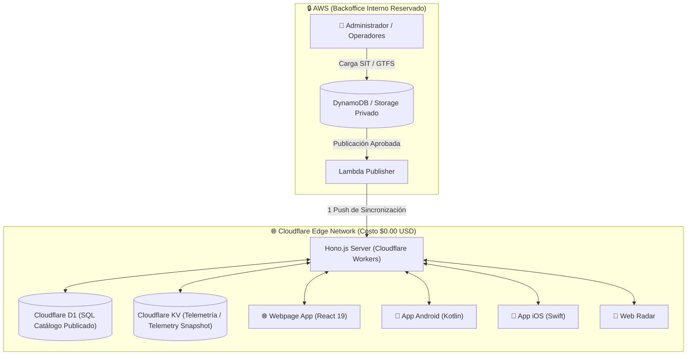

# 🏗️ Arquitectura del Sistema (Public Edge Shield)

---

## 📌 Diagrama de Flujo y Aislamiento de Infraestructura

---

## 🔑 Principios Clave de Diseño

1. **Aislamiento Financiero Total (Zero AWS Exposure)**:
   - Los usuarios finales consumen **0 peticiones** directamente contra la cuenta de AWS.
   - Todo el tráfico de producción se resuelve en la red Edge de Cloudflare sin cobro por transferencia de salida (0$ Egress).

2. **Tipado End-to-End en TypeScript**:
   - Tanto el servidor Hono.js como la aplicación React comparten las definiciones de modelo en un mismo repositorio (`collie-mobility-transit-webpage-app`).

3. **Compatibilidad Universal Multi-Cliente**:
   - El backend Hono.js expone las mismas rutas estructuradas en JSON que requieren las aplicaciones móviles Android, iOS y el visor Web Radar.
