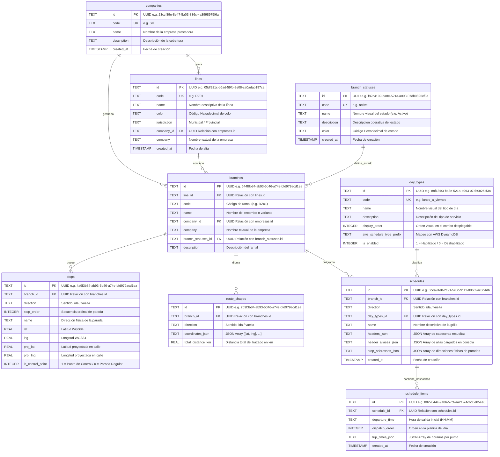

# 🗄️ Esquema Relacional de Base de Datos (Cloudflare D1)

Este documento especifica el modelo relacional de datos de **Cloudflare D1** (`collie-mobility-transit-db`) para la aplicación Full-Stack Edge **`collie-mobility-transit-webpage-app`**. Todas las claves primarias (`id`) y claves foráneas en las 9 tablas utilizan exclusivamente el formato **UUID v4 / UUID v5**.

---

## 📐 Diagrama Entidad-Relación (Mermaid)

---

## 📊 Descripción de las 9 Tablas Relacionales (Todas con Identificador UUID)

### 1. `companies` (Empresas de Colectivos)
- Contiene los datos institucionales de las empresas de transporte (`SIT`, `228 (San Isidro)`).
- **Clave Primaria**: `id` (UUID v4).

### 2. `lines` (Líneas de Colectivos)
- Almacena cada línea comercial o tarifa.
- **Clave Primaria**: `id` (UUID v4).
- **Clave Foránea**: `company_id` (UUID) -> `companies(id)`.

### 3. `branch_statuses` (Estados Operativos de Ramal)
- Define el estado operativo del servicio (`active`, `interrupted`, `reduced`, `suspended`).
- **Clave Primaria**: `id` (UUID v4).

### 4. `branches` (Ramales / Recorridos)
- Almacena los ramales y variantes de cada línea.
- **Clave Primaria**: `id` (UUID v4).
- **Claves Foráneas**: `line_id` (UUID) -> `lines(id)`, `company_id` (UUID) -> `companies(id)`, `branch_statuses_id` (UUID) -> `branch_statuses(id)`.

### 5. `stop_groups` (Grupos de Paradas Unificadas / Estaciones)
- Agrupa múltiples paradas físicas de distintos ramales que comparten un nodo de espera (ej. "Terminal NK", "Plaza Italia").
- **Clave Primaria**: `id` (UUID v4).
- **Campos**: `code` (UK), `name`, `lat`, `lng`, `description`, `is_enabled`.

### 5b. `stop_group_details` (Detalles y Coordenadas Específicas del Grupo)
- Almacena sub-ubicaciones, coordenadas exactas de refugios, dársenas o plataformas dentro del grupo de paradas.
- **Clave Primaria**: `id` (UUID v4).
- **Clave Foránea**: `stop_group_id` (UUID) -> `stop_groups(id)`.
- **Campos**: `name`, `lat`, `lng`, `address`, `platform_code`, `description`, `display_order`.

### 6. `stops` (Paradas Físicas por Ramal)
- Paradas geolocalizadas por ramal y sentido (`ida` / `vuelta`).
- **Clave Primaria**: `id` (UUID v4).
- **Claves Foráneas**: `branch_id` (UUID) -> `branches(id)`, `stop_group_id` (UUID) -> `stop_groups(id)`.

### 6. `route_shapes` (Trazados Vectoriales)
- Coordenadas geográficas para renderizar el recorrido en los mapas interactivos.
- **Clave Primaria**: `id` (UUID v4).
- **Clave Foránea**: `branch_id` (UUID) -> `branches(id)`.

### 7. `day_types` (Tipos de Día)
- Definición de tipos de servicio o combos con identificador único UUID (`id`).
- **Campos Destacados**: `is_enabled` (INTEGER: `1` = Habilitado / `0` = Deshabilitado). Permite ocultar dinámicamente horarios estacionales o extraordinarios (e.g. Horario de Invierno `especial`).
- **Clave Primaria**: `id` (UUID v4).

### 8. `schedules` (Grilla de Horarios Maestro)
- Cabecera de la grilla de horarios por ramal, sentido y tipo de día. Almacena las paradas de control y alias.
- **Clave Primaria**: `id` (UUID v4).
- **Claves Foráneas**: `branch_id` (UUID) -> `branches(id)`, `day_types_id` (UUID) -> `day_types(id)`.

### 9. `schedule_items` (Despachos e Horarios Individuales)
- Filas de servicios/despachos individuales que componen la grilla de horarios.
- **Clave Primaria**: `id` (UUID v4).
- **Clave Foránea**: `schedule_id` (UUID) -> `schedules(id)`.
