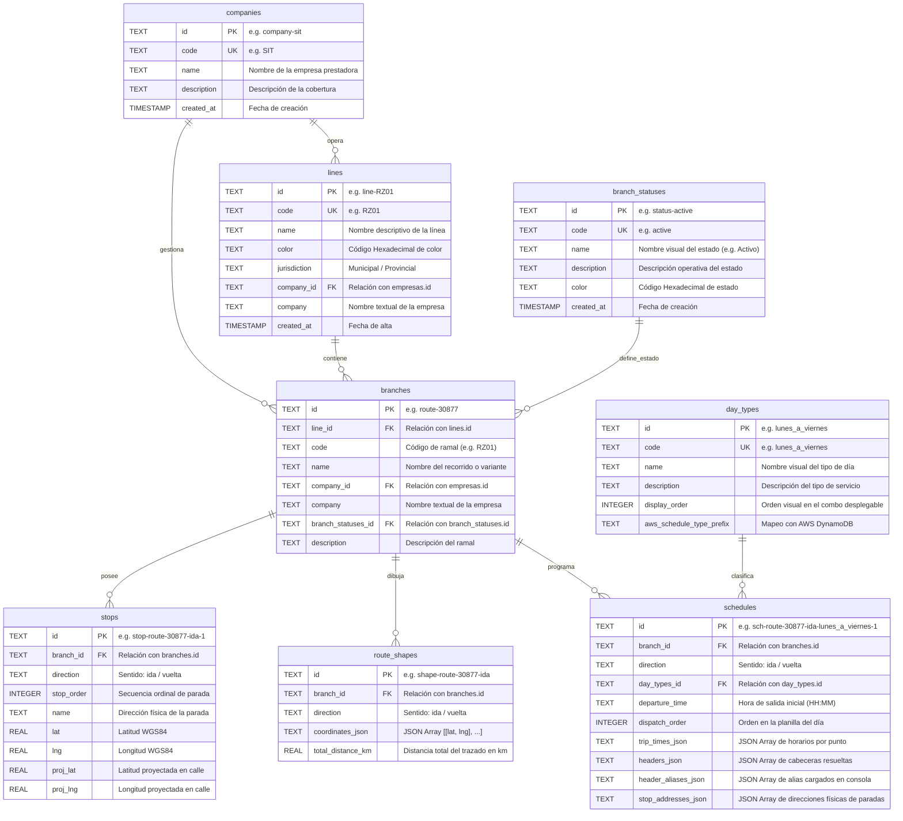

# 🗄️ Esquema Relacional de Base de Datos (Cloudflare D1)

Este documento especifica el modelo relacional de datos de **Cloudflare D1** (`collie-mobility-transit-db`) para la aplicación Full-Stack Edge **`collie-mobility-transit-webpage-app`**.

---

## 📐 Diagrama Entidad-Relación (Mermaid)

---

## 📊 Descripción de las 8 Tablas Relacionales (Todas en Plural)

### 1. `companies` (Empresas de Colectivos)
- Contiene los datos institucionales de las empresas de transporte (`SIT`, `228 (San Isidro)`).
- **Clave Primaria**: `id` (Ej: `company-sit`, `company-228`).

### 2. `lines` (Líneas de Colectivos)
- Almacena cada línea comercial o tarifa.
- **Clave Foránea**: `company_id` -> `companies(id)`.

### 3. `branch_statuses` (Estados Operativos de Ramal)
- Define el estado operativo del servicio (`active`, `interrupted`, `reduced`, `suspended`).
- **Clave Primaria**: `id` (Ej: `status-active`, `status-interrupted`).

### 4. `branches` (Ramales / Recorridos)
- Almacena los ramales y variantes de cada línea.
- **Claves Foráneas**: `line_id` -> `lines(id)`, `company_id` -> `companies(id)`, `branch_statuses_id` -> `branch_statuses(id)`.

### 5. `stops` (Paradas Físicas)
- Paradas geolocalizadas por ramal y sentido (`ida` / `vuelta`).
- **Clave Foránea**: `branch_id` -> `branches(id)`.

### 6. `route_shapes` (Trazados Vectoriales)
- Coordenadas geográficas para renderizar el recorrido en los mapas interactivos.
- **Clave Foránea**: `branch_id` -> `branches(id)`.

### 7. `day_types` (Tipos de Día)
- Definición de tipos de servicio o combos para filtrado de horarios con secuencia visual (`display_order`):
  1. `Lunes a Viernes`
  2. `Sábados`
  3. `Domingos y Feriados`
  4. `Especial (Horario Extraordinario / Invierno)`

### 8. `schedules` (Horarios y Puntos Intermedios)
- Planilla con horarios de salida y matriz de tiempos de paso por paradas de control.
- **Claves Foráneas**: `branch_id` -> `branches(id)`, `day_types_id` -> `day_types(id)`.
